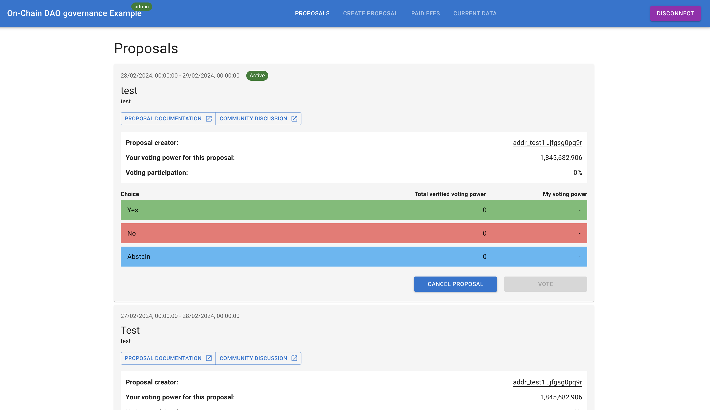
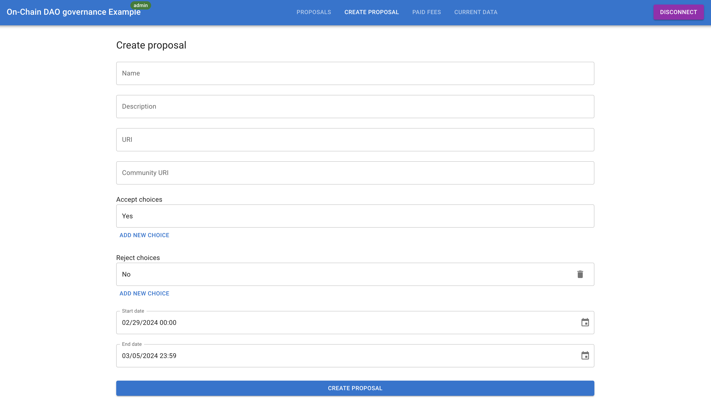
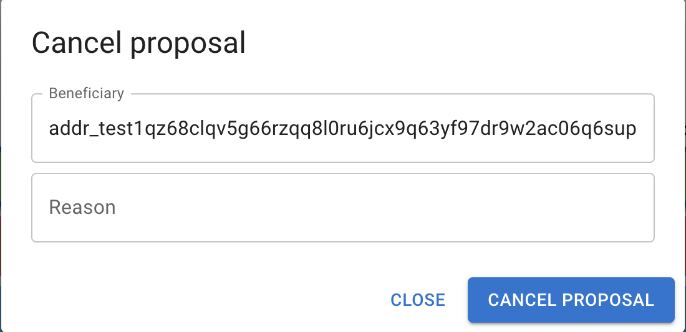

# Example React application for Open-Source On-Chain DAO Governance

This is an example frontend application built using React and Vite that uses [`@wingriders/governance-frontend-react-sdk`](../sdk/README.md) package.

## Run

```bash
yarn install
yarn dev
```

The example application will be available at http://localhost:5173.

## Implemented features

### Wallet connection

Currently, the example application supports only Eternl wallet for simplicity, but you can easily extend it to support any CIP-0030 compatible wallet. You can connect your wallet by clicking on the _CONNECT ETERNL_ button in the top right corner:


### List of proposals

On the _PROPOSALS_ page, you can see the list of all proposals that haven't been cancelled:


Each proposal will display these attributes:

1. Name
2. Description
3. Link to the IPFS document
4. Link to the community discussion
5. Address of the proposal creator
6. Your voting power for this proposal (if your wallet is connected)
7. Current voting participation
8. Proposal choices
9. Option to vote for the proposal (if your wallet is connected)
10. Option to cancel the proposal (if you connect with the DAO admin wallet)
11. Option to conclude the proposal (if you connect with the DAO admin wallet and the proposal is past it's end time)

### Proposal creation

When you connect your wallet you will be able to create proposals on the _CREATE PROPOSAL_ page:


Fields description:

1. **Name**: title of the proposal
2. **Description**: a brief description or details about the proposal
3. **URI**: unique IPFS resource identifier, linked to a file or content related to the proposal and describing it in details
4. **Community URL**: link to the community or discussion platform relevant to the proposal
5. **Accept choices**: options community members can choose to accept the proposal
6. **Reject choices**: options community members can choose to reject the proposal
7. **Start date**: start date of the poll (date & time, by default the same date will be used for voting power snapshot)
8. **End date**: end date of the poll (date & time)

To create a proposal, a collateral of X governance tokens is required.

When you fill all the fields, you can click on the `CREATE PROPOSAL` button and sign the transaction. Once the transaction is confirmed on the blockchain, your proposal will appear in the list of all proposals.

### Casting votes

You can cast vote on any of the active proposal by selecting the choice you want to vote for and clicking on the _VOTE_ button:


When you successfully sign the transaction, you will see a success message with hash of the transaction and your vote will be added once the transaction is confirmed on the blockchain.

### Cancelling proposals

When you connect with the DAO admin wallet, you are able to cancel proposals (for whatever reason you as a DAO decided). You can cancel a proposal by clicking on the _CANCEL PROPOSAL_ button at any proposal that is not concluded yet:


You wil be asked to fill these field:

1. **Beneficiary**: address where the proposal collateral will be sent. This field will be pre-filled with your address as a DAO admin
2. **Reason**: message that indicates why the proposal was cancelled

### Concluding proposals

When you connect with the DAO admin wallet, you are able to conclude proposals, which means marking them as _PASSED_ or _FAILED_ when the voting period ends. You can conclude a proposal by clicking on the _CONCLUDE PROPOSAL_ button at any proposal that is not concluded yet and the voting period finished:


You wil be asked to fill these field:

1. **Results**: select either _PASSED_ on _FAILED_ based on the voting participation and the required participation that you as a DAO chose for this proposal
1. **Beneficiary**: address where the proposal collateral will be sent. This field will be pre-filled with your address as a DAO admin (when the proposal passes, you usually send the collateral to the proposal creator, but that's on you as a DAO to decide)
1. **Note**: any message that describes the conclusion

### Paid transaction fees

When you visit the _PAID FEES_ page, you can see the total value of transaction fees that have been paid for every action in your DAO governance:


This includes:

- Total transaction fees paid for proposals (proposals creations, cancellations, conclusions)
- Total transaction fees paid for votes

### Current data of your DAO governance

When you visit the _CURRENT DATA_ page, you can see some useful information about your DAO governance:


This includes:

- Current theoretical maximum voting power
- Your current voting power (if you connect your wallet)
- Number of active proposals
- Number of active proposals where you can vote and haven't voted yet (if you connect your wallet)
